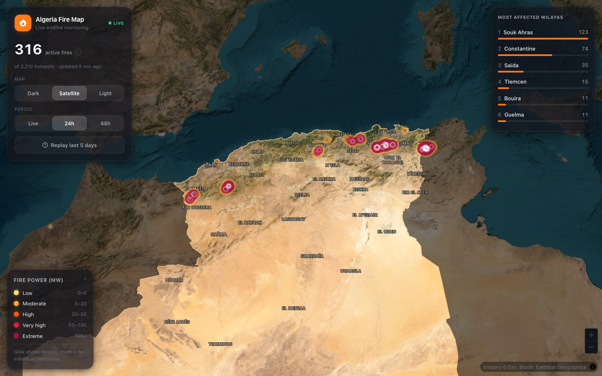

<div align="center">


# 🔥 FireWatch

### Real‑time wildfire intelligence from space.

**Live fire detections, intensity, and climate risk – for communities on the front line.**

[](https://nextstep-hacks-2026.devpost.com/)
[](LICENSE)
[](https://firms.modaps.eosdis.nasa.gov/)

</div>

---

## 🌍 The problem

Every summer, wildfires burn across the Mediterranean basin — and the communities living on the front line get almost no usable information. Satellite data exists, but it's locked in bulky scientific exports, scattered across agencies, and hours out of date by the time it reaches the public. Farmers, civil-protection crews, families in fire-prone regions, and climate researchers all need the same thing: **"Is a fire burning near me right now, how strong is it, and how dangerous will conditions be over the next days?"**

Raw NASA fire detections are noisy. Low-confidence pixels, agricultural burns, and industrial gas flares all look like wildfires from space. Getting a trustworthy, real-time answer — presented plainly, on a phone, in the local language — is the difference between an early warning and a headline.

## 💡 The solution

FireWatch turns NASA's satellite fire archive into **live, trustworthy wildfire intelligence delivered straight to the public, in plain language, on any device**. It detects real fires from space, filters out the noise, adds live weather-driven fire danger, and puts it all on an interactive map that a farmer in the mountains or a rescue crew in the field can open on a phone and understand in seconds.

```
NASA FIRMS (VIIRS + MODIS) ─┐                         Open-Meteo
                            ▼                            ▼
        ┌────────── FastAPI (Railway) — FireWatch API ──────────┐
        │  /fires  /place  /risk  /stats  /events  /grid        │
        │  Redis cache · confirmed-only filter · FWI risk       │
        └───────────────────────────┬───────────────────────────┘
                                    ▼  HTTPS (no secrets client-side)
                        Next.js (Vercel) — stateless, SEO-ready
                          MapLibre GL · dark / satellite / light
```

## ✨ What it does

- 🔥 **Live fire map** — active-fire detections from NASA FIRMS (VIIRS 375 m + MODIS), glowing by intensity (fire radiative power), updated throughout the day.
- ✅ **Confirmed only** — every dot on the map passed a high-confidence, ≥ 15 MW power filter. Low-confidence noise, agricultural burns, and industrial gas flares are filtered out, so what you see is a real wildfire.
- 📍 **Tap a fire, know where it is** — power (MW), confidence, detection time, satellite, and the exact place (town · wilaya · district) via reverse geocoding.
- ⏮️ **5-day timeline replay** — scrub or play back the last five days and watch fires ignite and spread, with an activity histogram.
- 🌡️ **Climate risk that matters (FWI)** — per-region Fire Weather Index computed live from Open-Meteo weather (heat, dryness, wind, rain recency) — the same standard used by EU fire services (EFFIS). It answers "how fast could a fire spread today", per wilaya, coloured on a choropleth map.
- 📊 **Long-term intelligence** — persistent storage (PostGIS + object storage) builds a national historical archive: statistics by year, season, and region; fire-event clustering turns raw pixels into incidents; a grid-seeded dataset is prepared for ML risk prediction.
- 🌐 **For real communities** — Arabic / French / English, RTL layout, mobile-first bottom-sheet UX, and multilingual SEO. Built for the people living on the front line — not just data scientists.

## 🏆 Why it's special (originality)

Satellite fire-data portals exist, but they dump raw CSV/GeoJSON on technical users. FireWatch does the heavy lifting **for the public**: a confirmed-only quality filter, live weather-based risk, clustered incidents, local-language place names, and an interface that reads like a live warning system rather than a science console. It moves wildfire data from "research archive" to "community early-warning".

## 🔧 How it's built (technology)

A genuinely impressive pipeline, end to end:

- **Ingestion & quality** — FastAPI calls NASA's FIRMS Area API, clips every detection to a precise national border polygon (simplified, buffered to keep border fires), and applies a confidence + radiative-power filter so only real wildfires reach the map.
- **Risk modelling** — computes the Fire Weather Index per region from live Open-Meteo data, following the EFFIS methodology — a real climate-science model, delivered in one API call.
- **Persistence & history** — PostGIS-backed ingestion pipeline (scheduler → dedupe → upsert) archives detections; spatiotemporal clustering (ST-DBSCAN-style) groups pixels into tracked **incidents**; a border-clipped 0.1° grid seeds the training dataset for future ML risk prediction.
- **Performance** — Redis caching with ETag, edge-rendered Next.js pages, and a fully stateless frontend.
- **Frontend** — Next.js (App Router, TypeScript) + MapLibre GL; bilingual RTL/ LTR; strong SEO (SSG, Open Graph, sitemap, JSON-LD).

**Built with:** TypeScript · React/Next.js · MapLibre GL · Python · FastAPI · Redis · PostgreSQL/PostGIS (Supabase) · NASA FIRMS API · Open-Meteo · OpenStreetMap/Esri · Docker.

## 🎯 Earth Forward, fully implemented

This project lives squarely in the Earth Forward theme: environmental monitoring that helps communities **adapt to climate change and protect ecosystems**. Wildfires are among the most destructive symptoms of a warming climate — and FireWatch takes a pressing problem (unusable satellite fire data) and solves it with working technology, live in production today.

## 🤝 Learning & engineering stretch

- A real multi-service deployment: stateless frontend, endpoint-owning backend, cache layer, database, scheduler — where each secret stays server-side.
- Geospatial work well beyond "markers on a map": polygon clipping with buffer-safe borders, wilaya-level aggregation, spatiotemporal event clustering, and a national training-grid generator.
- Multilingual UX: full Arabic RTL support with RTL-aware animations, a locale-preserving cookie system, and multilingual sitemap/SEO.

## 🎨 Design

Premium dark theme with glass panels, a fire-intensity colour ramp (low → extreme), timeline scrubbing, map-driven focus control, and full mobile support with a thumb-zone bottom sheet. The FireWatch mark — a gradient flame inside a radar watch ring — communicates the product at a glance.

## 📸 Screenshots


<div align="center">

 


</div>

---

## 🚀 Deployment (production)

The project ships ready to deploy: the frontend on **Vercel**, the backend on **Railway**, wired by two environment variables. Deploy order: **backend first, frontend second.**

### 1. Backend → Railway

1. **Create the project** — Railway → *New Project → Deploy from GitHub* → pick this repository. Railway auto-detects the root [`railway.json`](railway.json), which points the build at `services/api/Dockerfile`. No root-directory setting needed.
2. **Add Redis** — in the project, add a Redis database (Railway's one-click plugin).
3. **Environment variables** (see [`services/api/.env.example`](services/api/.env.example)):

   | Variable | Purpose |
   |---|---|
   | `NASA_FIRMS_MAP_KEY` | Free key from [NASA FIRMS](https://firms.modaps.eosdis.nasa.gov/api/area/) — enables live fire data |
   | `REDIS_URL` | Link the Redis plugin; without it an in-memory cache is used |
   | `CORS_ORIGINS` | The frontend's public URL (e.g. `https://firewatch.vercel.app`) |
   | `DATABASE_URL` | Optional — Supabase Postgres+PostGIS connection; enables history, stats & ingestion |
   | `INGEST_ENABLED` / `ADMIN_TOKEN` | Optional — enables the scheduled ingestion loop behind an admin token |

4. **Deploy** — Railway serves the API at a generated URL like `https://xxx.up.railway.app`. Check `/health` — it returns `{ "status": "ok" }`. The OpenAPI docs are at `/docs`.

### 2. Frontend → Vercel

1. **Import project** — Vercel → *Add New Project* → this repository, **Root Directory: `apps/web`**.
2. **Environment variables** (see [`apps/web/.env.example`](apps/web/.env.example)):
   - `NEXT_PUBLIC_API_URL` → the Railway backend URL (no trailing slash)
   - `NEXT_PUBLIC_SITE_URL` → the frontend's own URL (used for SEO/OG)
3. **Deploy** — framework auto-detects Next.js; done.

### Optional database (Supabase)

To unlock history, national statistics, incident clustering, and the ML training grid: create a free Supabase project (Postgres + PostGIS), apply the migrations in [`supabase/migrations/`](supabase/migrations/), and set `DATABASE_URL` on the Railway service.

---

## 🛠️ Run it locally

**Prerequisites:** Node 20+, Python 3.12+, optionally Docker. A free [FIRMS key](https://firms.modaps.eosdis.nasa.gov/api/area/) unlocks live data.

**Backend (Docker):**
```bash
cp services/api/.env.example services/api/.env   # paste your NASA_FIRMS_MAP_KEY
docker compose up --build                        # API → http://localhost:8000/docs
```

or without Docker:
```bash
cd services/api && python -m venv .venv && source .venv/bin/activate
pip install -r requirements.txt
uvicorn app.main:app --reload
```

**Frontend:**
```bash
cd apps/web
cp .env.example .env.local        # NEXT_PUBLIC_API_URL=http://localhost:8000
npm install && npm run dev        # → http://localhost:3000
```

## 📁 Repository layout

```
apps/web            Next.js frontend (MapLibre, i18n, SEO)
services/api        FastAPI backend (fires, place, risk, stats, events, grid)
supabase/migrations Postgres/PostGIS schema (optional persistence)
railway.json        Railway build config (backend)
docker-compose.yml  Local dev stack (api + redis)
docs/screenshots    Product screenshots
```

## 📡 API surface

| Endpoint | Description |
|---|---|
| `GET /fires?days=1..5` | Active-fire detections (GeoJSON), confirmed-only |
| `GET /place?lat=&lng=` | Reverse-geocoded place for a fire |
| `GET /risk` | Per-region Fire Weather Index + danger class |
| `GET /stats` | National wildfire statistics |
| `GET /events` | Clustered fire incidents |
| `GET /health` | Service status |

## License

[MIT](./LICENSE) — free to use, modify, and distribute.

## Acknowledgements

NASA FIRMS · Open-Meteo · OpenStreetMap / OpenFreeMap / OpenMapTiles · Esri World Imagery · and the wildfire researchers and civil-protection responders working to keep front-line communities safe.
