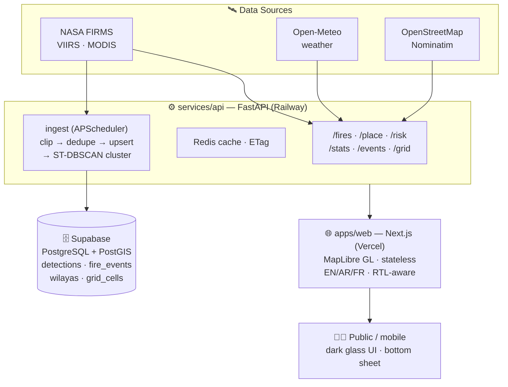

# 🔥 FireWatch — Devpost Project Submission

Copy each section into the corresponding field on Devpost. All images use raw GitHub URLs so they render anywhere.

---

## 🔥 Project name

**FireWatch**

---

## 📝 Tagline

**Real‑time wildfire intelligence from space.**
Live fire detections, intensity, and climate risk — for the communities on the front line.

<div align="center">
  
</div>

---

## 🌍 Inspiration

Every summer, wildfires sweep across the Mediterranean basin. Somewhere in the mountains, a farmer looks up and sees smoke on the horizon. Somewhere else, a civil-protection crew needs to know if the fire they fought yesterday has reignited. And every day, NASA's satellites orbit overhead, detecting every active wildfire on Earth — **and almost none of that knowledge reaches the people standing in front of the flames.**

The data exists. It's just locked in bulky scientific exports, scattered across agencies, polluted with noise, and written for researchers — not for a family deciding whether to evacuate, in their own language, on a phone.

**FireWatch closes that gap.** It turns NASA's satellite fire archive into a live, trustworthy early-warning system that a farmer, a rescue crew, or a climate researcher can open on any device and understand in seconds. This is Earth Forward, in production.

---

## 💡 What it does

FireWatch transforms noisy fire-science data into a **community early-warning system**. It detects real fires from space, filters out the noise, adds live weather-driven fire danger, and puts it all on an interactive map — in plain language, on any device.

### 🔥 Live fire map
Active-fire detections from NASA FIRMS (VIIRS 375 m + MODIS) on an interactive MapLibre map. Points glow and scale with radiative power (FRP). Dark / satellite / light basemap styles.

### ✅ Confirmed only — no false alarms
Server-side quality gate: confidence ≥ `high` and FRP ≥ 15 MW. Low-light noise, agricultural burns, and industrial gas flares never reach the map. Border-polygon clipping keeps cross-border fires out of the wrong region.

### 📍 Tap a fire, know the place
Power (MW), confidence, detection time, satellite — and reverse-geocoded **town · wilaya · district** via OpenStreetMap Nominatim.

### ⏮️ 5-day timeline replay
Scrub or play back the last five days; watch how a fire ignited and spread, with a live activity histogram. See exactly when it started and how it moved.

### 🌡️ Climate risk (FWI)
The **Fire Weather Index** per region, computed from live Open-Meteo weather — the same standard used by EU fire services (EFFIS). Choropleth map, per-region ranking, 3-day forecast outlook. Know before the fire starts.

### 🧩 Incident clustering
ST-DBSCAN-style spatiotemporal clustering groups raw pixels into **incidents** — start, end, peak intensity, duration, affected area — archived in PostGIS.

### 📊 National statistics
Per-wilaya KPIs, rankings, seasonality, yearly trends, and cumulative "signature curves" — with a choropleth of the most affected regions. 69 wilayas, each with its own page.

### 🤖 ML-ready archive
A border-clipped 0.1° training grid over the fire belt seeds a dataset for future risk-prediction models.

### 🌍 Multilingual & accessible
Arabic / French / English with full RTL layout; mobile bottom-sheet UX; RTL-aware animations.

### 🔎 SEO & shareable
Per-locale Open Graph, sitemap, JSON-LD — every link previews rich everywhere.

---

## 🏗️ How we built it

A genuine multi-service pipeline — a stateless frontend, an endpoint-owning backend, a cache layer, a persistent database, and a scheduler. Secrets stay server-side; the browser only calls the public API.



```
NASA FIRMS (VIIRS·MODIS) ─┐  Open-Meteo  ┌─────────────┐  OpenStreetMap/Nominatim
                          ▼        ▲     ▼              ▼            ▲
        ┌──────────────────────────────────────────────────────────────────────┐
        │                  services/api — FastAPI (Railway)                     │
        │  /fires /place /risk /stats /events /grid    ┌── ingest (APScheduler)─┐
        │  Redis cache · ETag · confirmed-only filter  │ FIRMS pull → border clip│
        │         │                                    │ → dedupe → PostGIS upsert│
        │         │                                    │ → ST-DBSCAN cluster      │
        └─────────┼────────────────────────────────────┴──────────┬─────────────┘
                  │ GeoJSON · risk · incidents · stats            │ PostGIS archive
                  ▼                                               ▼
        ┌───────────────────────────┐      ┌────────────────────────────────┐
        │  apps/web — Next.js/Vercel │ SSL  │  Supabase (PostgreSQL+PostGIS) │
        │  MapLibre GL · stateless   │      │  detections · fire_events ·    │
        │  EN/AR/FR · RTL-aware      │      │  wilayas · grid_cells · history│
        └───────────────────────────┘      └────────────────────────────────┘
                  ▲                        no secrets client-side ✔
                  │ HTTPS
                  ▼
            📱 Any device — dark glass UI, mobile bottom sheet, RTL
```

### 🔧 The tech stack

| Layer | Technology | Why it matters |
|---|---|---|
| **Frontend** | Next.js 16 (App Router) · TypeScript · React 19 · MapLibre GL · SWR | Edge-rendered, fully stateless; interactive map; realtime UX. |
| **Backend** | FastAPI · Python 3.12 · Pydantic-settings | Typed, documented endpoint-owning API (OpenAPI/`/docs`). |
| **Caching** | Redis (with in-memory fallback) · ETag | Sub-second repeat queries across days/hours of detections. |
| **Database** | PostgreSQL + PostGIS (Supabase) | Geospatial detections, incidents, wilaya boundaries, training grid. |
| **Scheduler** | APScheduler (in-process) | FIRMS ingest → clip → upsert → cluster, every N minutes. |
| **Geospatial** | Shapely border clipping · ST-DBSCAN-style clustering · wilaya polygons | Cross-border pollution removed; pixels → tracked incidents. |
| **ML (seed)** | 0.1° border-clipped training grid | National dataset for future risk-prediction models. |
| **Data sources** | NASA FIRMS · Open-Meteo · OpenStreetMap · OpenFreeMap · Esri | Free, global, live satellite + weather + reverse geocoding. |
| **Tooling** | Docker · Docker Compose · Railway · Vercel | One-command local stack; deploy-ready configs shipped. |
| **i18n** | next-intl (EN/AR/FR) · RTL-aware | The community audience gets a native-language UX. |

---

## ⚔️ Challenges we ran into

This project pushed us well past "put markers on a map."

**🛰️ Noise filtering** — NASA FIRMS returns every thermal anomaly: gas flares, agricultural burns, low-confidence pixels. We had to build a server-side quality gate (`confidence ≥ high && FRP ≥ 15 MW`) and clip everything to Algeria's border polygon with Shapely, so Tunisian fires don't get counted toward border wilayas like Souk Ahras.

**🗺️ Map rendering** — MapLibre GL v6 renders a blank map (no tiles, `transform` undefined). We pinned to v4.7.1 and built custom overlays that survive basemap switches with `{ diff: false }`.

**🌐 Arabic RTL** — Arabic labels render disconnected/reversed without `setRTLTextPlugin`, and the entire UI needs logical CSS properties (`insetInlineStart/End`) to flip correctly. We built RTL-aware animations and a mobile bottom-sheet that works in both directions.

**🔥 Fire Weather Index** — Implementing the EFFIS-standard FWI from raw Open-Meteo data: moisture codes, wind adjustment, and the final danger class. No training data needed — it's a physically-based index, but getting the math right took real work.

**🧩 ST-DBSCAN clustering** — Grouping thousands of raw detections into stable incidents with stable IDs, temporal split, and monotonic growth. Re-running is idempotent; new clusters reuse existing event IDs, and bridging clusters merge.

**⚡ Performance** — Versioned Redis cache keys (`fires:v2:days=N`, `risk:all:v3`), ETag headers, and chunked Open-Meteo batching (20 locations per request) to keep repeat queries sub-second.

---

## 📚 What we learned

**Geospatial engineering at scale** — Shapely border clipping with buffered polygons, ST-DBSCAN clustering, convex hulls for affected area, wilaya assignment from point-in-polygon.

**Climate science** — The Fire Weather Index model: how temperature, humidity, wind, and rain combine into a single danger number. The same model EU fire services use.

**Production-grade architecture** — A stateless frontend, an endpoint-owning backend, Redis caching, PostGIS persistence, and a scheduler — all wired with two env vars. No secrets in the browser.

**Multilingual UX** — RTL layout isn't just flipping text. It's logical CSS properties, RTL-aware animations, bottom-sheet gestures, and making sure every component works in both directions.

**Data quality matters more than data quantity** — Filtering out gas flares and agricultural burns was the difference between a useful tool and a misleading one.

---

## 🚀 What's next

**Persistence milestone** — We need Supabase (Postgres+PostGIS) and Cloudflare R2 to unlock:
- Full history beyond 5 days
- Daily feature/label snapshots → training dataset for ML risk models
- Server-side incident clustering at scale
- Burned-area detection (Sentinel NBR)
- Alert subscriptions (SMS/push)

**French translation** — Arabic and English are live; French is next for full Maghreb coverage.

**Official stats overlay** — Integrate DGPC (Direction Générale de la Protection Civile) official fire statistics for validation.

---

## 🎯 Earth Forward — theme, fully embodied

Wildfires are among the 21st century's clearest climate symptoms. FireWatch takes a pressing environmental problem — **unusable satellite fire data** — and solves it with **working technology**, live in production. It directly addresses the theme statement's call for projects that help communities **adapt to climate change** and **protect ecosystems**, by giving the people living on the front line an early-warning system that actually reads like one.

---

## 🏅 Judging Criteria

| Criterion | How *FireWatch* answers it |
|---|---|
| **Originality** | Satellite fire-data portals dump raw CSV/GeoJSON on technical users. FireWatch does the heavy lifting *for the public*: confirmed-only quality filter, live weather risk, clustered incidents, local-language place names. It moves fire data from "research archive" to "community early-warning." |
| **Adherence to Track (Earth Forward)** | Climate adaptation & ecosystem protection, embodied end to end — not a partial fit. |
| **Completion** | Works today: endpoints return real data, the UI is finished — not an MVP. Deploy configs (`railway.json`, Dockerfile, compose) are shipped, so the same result reproduces anywhere. |
| **Learning** | Geospatial clipping with buffered borders, ST-DBSCAN-style clustering, an EFFIS-standard FWI model, multilingual RTL — a stretch far past "markers on a map." |
| **Design** | Premium dark theme with glass panels, fire-intensity colour ramp, animated timeline scrubbing, and a thumb-zone bottom sheet on mobile. The FireWatch mark — gradient flame inside a radar watch ring — reads at icon size. |
| **Technology** | Multi-service pipeline with an endpoint-owning FastAPI backend, PostGIS archive, Redis cache, scheduler, a stateless Next.js edge frontend, plus border-safe clipping and an FWI risk model — genuinely impressive, component-rich engineering. |

---

## 📸 Screenshots

### 🖥️ Desktop — live map view


| 🌡️ Risk (FWI) view | 🛰️ Satellite imagery view |
|---|---|
|  |  |

| 📱 Mobile — bottom-sheet UX |
|---|
|  |

---

## 📄 License & Acknowledgements

[MIT](https://github.com/digiflowhelp-stack/FireWatch/blob/main/LICENSE) — free to use, modify, and distribute.

Gratefully built on: **NASA FIRMS** satellite detections · **Open-Meteo** weather (per its [CC-BY 4.0 licence](https://creativecommons.org/licenses/by/4.0/)) · **OpenStreetMap / OpenFreeMap / OpenMapTiles / Esri** · and every wildfire researcher and civil-protection responder working to keep front-line communities safe.

<div align="center">

<sub>Made with 🔥 and urgent care, for the front line that counts on an early warning.</sub>

</div>
