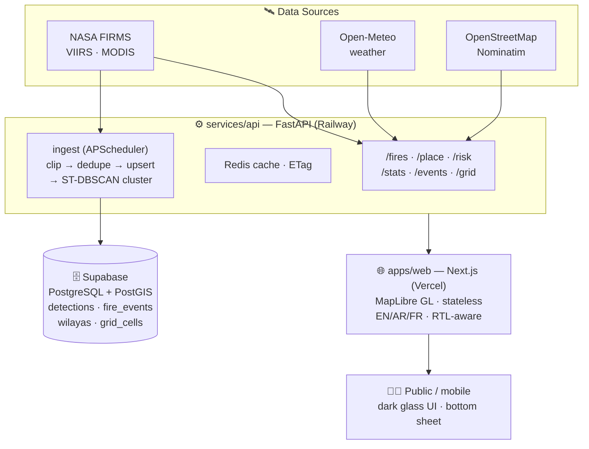

# 🔥 FireWatch — Devpost Project Submission

Copy the section below into your Devpost project description. All images use raw GitHub URLs so they render anywhere. The logo, problem, solution, architecture diagram, tech stack, and judging-criteria matrix are all ready to paste.

---

## Project description (paste into Devpost)

<div align="center">

<a href="https://github.com/digiflowhelp-stack/FireWatch">
  
</a>

# 🔥 FireWatch

### Real‑time wildfire intelligence from space.
**Live fire detections, intensity, and climate risk — for the communities on the front line.**

[](https://nextstep-hacks-2026.devpost.com/)
[](https://github.com/digiflowhelp-stack/FireWatch#-api-reference)
[](https://github.com/digiflowhelp-stack/FireWatch/blob/main/LICENSE)

[](https://firms.modaps.eosdis.nasa.gov/)
[](#-the-tech-stack)
[](#-built-for-the-front-line)

</div>

---

## 📖 The story

Every summer, wildfires sweep across the Mediterranean basin. Somewhere in the mountains, a farmer looks up and sees smoke on the horizon. Somewhere else, a civil-protection crew needs to know if the fire they fought yesterday has reignited. And every day, NASA's satellites orbit overhead, detecting every active wildfire on Earth — **and almost none of that knowledge reaches the people standing in front of the flames.**

The data exists. It's just locked in bulky scientific exports, scattered across agencies, polluted with noise, and written for researchers — not for a family deciding whether to evacuate, in their own language, on a phone.

**FireWatch closes that gap.** It turns NASA's satellite fire archive into a live, trustworthy early-warning system that a farmer, a rescue crew, or a climate researcher can open on any device and understand in seconds. This is Earth Forward, in production.

---

## 🌍 The Problem

<table>
<tr>
<td width="50%" valign="top">

### 🛰️ Satellites see the fires. The public doesn't.

NASA's VIIRS & MODIS instruments detect active wildfires within hours — but the data arrives as raw scientific exports aimed at researchers, not at people on the ground.

### 🔇 Noise drowns the signal.

Alongside real wildfires, the stream is full of low-confidence pixels, agricultural burns, and industrial gas flares. A naive map of "red dots near you" misleads as often as it informs.

### 🗣️ Language and access barriers.

Where information does exist, it's in foreign-language PDFs and scientist-facing consoles — not in Arabic or French, not on a phone, not in plain words.

</td>
<td width="50%" valign="top">

### 🚨 What the front line actually needs

> **"Is a fire burning near me right now, how strong is it, and how dangerous will conditions be over the next days?"**

- ✅ Reliable, *confirmed* fire locations — filtered, debiased, trustworthy.
- 🌡️ A plain-language read on **fire weather danger**, region by region.
- ⏮️ History — how the fire near you ignited and spread over the last days.
- 📱 A mobile-first experience in the local language, usable by anyone.

Until now, the only public sources were researcher-oriented data consoles and static government bulletins. For front-line communities, that's noise.

</td>
</tr>
</table>

---

## 💡 The Solution

**FireWatch** transforms noisy fire-science data into a **community early-warning system**. It detects real fires from space, filters out the noise, adds live weather-driven fire danger, and puts it all on an interactive map — in plain language, on any device.

### ✨ The Features

<table>
<tr><th>🔥 Feature</th><th>How it works</th></tr>
<tr><td><b>Live fire map</b></td><td>Active-fire detections from NASA FIRMS (VIIRS 375 m + MODIS) on an interactive MapLibre map. Points glow and scale with radiative power (FRP). Dark / satellite / light styles.</td></tr>
<tr><td><b>Confirmed only</b></td><td>Server-side quality gate: confidence ≥ <code>high</code> and FRP ≥ 15 MW. Low-light noise and industrial flares never reach the map. Border-polygon clipping keeps cross-border fires out of the wrong region.</td></tr>
<tr><td><b>Tap a fire, know the place</b></td><td>Power (MW), confidence, detection time, satellite — and reverse-geocoded <b>town · wilaya · district</b> via OpenStreetMap Nominatim.</td></tr>
<tr><td><b>5-day timeline replay</b></td><td>Scrub or play back the last five days; watch how a fire ignited and spread, with a live activity histogram.</td></tr>
<tr><td><b>Climate risk (FWI)</b></td><td>The <b>Fire Weather Index</b> per region, computed from live Open-Meteo weather — the same standard used by EU fire services (EFFIS). Choropleth map, per-region ranking, 3-day forecast outlook.</td></tr>
<tr><td><b>Incident clustering</b></td><td>ST-DBSCAN-style spatiotemporal clustering groups raw pixels into <b>incidents</b> — start, end, peak intensity, duration — archived in PostGIS.</td></tr>
<tr><td><b>National statistics</b></td><td>Per-wilaya KPIs, rankings, seasonality, yearly trends, and cumulative "signature curves" — with a choropleth of the most affected regions. 69 wilayas, each with its own page.</td></tr>
<tr><td><b>ML-ready archive</b></td><td>A border-clipped 0.1° training grid over the fire belt seeds a dataset for future risk-prediction models.</td></tr>
<tr><td><b>Multilingual & accessible</b></td><td>Arabic / French / English with RTL layout; mobile bottom-sheet; RTL-aware animations.</td></tr>
<tr><td><b>SEO & shareable</b></td><td>Per-locale Open Graph, sitemap, JSON-LD — every link previews rich everywhere.</td></tr>
</table>

---

## 🏗️ Architecture

A genuine multi-service pipeline — a stateless frontend, an endpoint-owning backend, a cache layer, a persistent database, and a scheduler. Secrets stay server-side; the browser only calls the public API.



```
NASA FIRMS (VIIRS·MODIS) ─┐  Open-Meteo  ┌─────────────┐  OpenStreetMap/Nominatim
                          ▼        ▲     ▼              ▼            ▲
        ┌──────────────────────────────────────────────────────────────────────┐
        │                  services/api — FastAPI (Railway)                     │
        │  /fires /place /risk /stats /events /grid    ┌── ingest (APScheduler)─┐
        │  Redis cache · ETag · confirmed-only filter  │ FIRMS pull → border clip│
        │         │                                    │ → dedupe → PostGIS upsert│
        │         │                                    │ → ST-DBSCAN cluster      │
        └─────────┼────────────────────────────────────┴──────────┬─────────────┘
                  │ GeoJSON · risk · incidents · stats            │ PostGIS archive
                  ▼                                               ▼
        ┌───────────────────────────┐      ┌────────────────────────────────┐
        │  apps/web — Next.js/Vercel │ SSL  │  Supabase (PostgreSQL+PostGIS) │
        │  MapLibre GL · stateless   │      │  detections · fire_events ·    │
        │  EN/AR/FR · RTL-aware      │      │  wilayas · grid_cells · history│
        └───────────────────────────┘      └────────────────────────────────┘
                  ▲                        no secrets client-side ✔
                  │ HTTPS
                  ▼
            📱 Any device — dark glass UI, mobile bottom sheet, RTL
```

---

## 🔧 The Tech Stack

| Layer | Technology | Why it matters |
|---|---|---|
| **Frontend** | Next.js 16 (App Router) · TypeScript · React 19 · MapLibre GL · SWR | Edge-rendered, fully stateless; interactive map; realtime UX. |
| **Backend** | FastAPI · Python 3.12 · Pydantic-settings | Typed, documented endpoint-owning API (OpenAPI/`/docs`). |
| **Caching** | Redis (with in-memory fallback) · ETag | Sub-second repeat queries across days/hours of detections. |
| **Database** | PostgreSQL + PostGIS (Supabase) | Geospatial detections, incidents, wilaya boundaries, training grid. |
| **Scheduler** | APScheduler (in-process) | FIRMS ingest → clip → upsert → cluster, every N minutes. |
| **Geospatial** | Shapely border clipping · ST-DBSCAN-style clustering · wilaya polygons | Cross-border pollution removed; pixels → tracked incidents. |
| **ML (seed)** | 0.1° border-clipped training grid | National dataset for future risk-prediction models. |
| **Data sources** | NASA FIRMS · Open-Meteo · OpenStreetMap · OpenFreeMap · Esri | Free, global, live satellite + weather + reverse geocoding. |
| **Tooling** | Docker · Docker Compose · Railway · Vercel | One-command local stack; deploy-ready configs shipped. |
| **i18n** | next-intl (EN/AR/FR) · RTL-aware | The community audience gets a native-language UX. |

---

## 🌐 Built for the front line

<table>
<tr>
<td width="33%" align="center">

### 🗣️ Languages
العربية · Français · English<br/>Full RTL layout

</td>
<td width="33%" align="center">

### 📱 Mobile-first
Thumb-zone bottom sheet<br/>RTL-aware animations

</td>
<td width="33%" align="center">

### 🌍 Community
Plain-language place names<br/>reverse-geocoded towns

</td>
</tr>
</table>

FireWatch isn't a science console — it's an early-warning system that reads like one. The gradient flame inside a radar watch ring, the fire-intensity colour ramp, the timeline scrubbing: every detail is designed for the person who needs an answer *now*.

---

## 🎯 Earth Forward — theme, fully embodied

Wildfires are among the 21st century's clearest climate symptoms. FireWatch takes a pressing environmental problem — **unusable satellite fire data** — and solves it with **working technology**, live in production. It directly addresses the theme statement's call for projects that help communities **adapt to climate change** and **protect ecosystems**, by giving the people living on the front line an early-warning system that actually reads like one.

---

## 🏅 Judging Criteria

| Criterion | How *FireWatch* answers it |
|---|---|
| **Originality** | Satellite fire-data portals dump raw CSV/GeoJSON on technical users. FireWatch does the heavy lifting *for the public*: confirmed-only quality filter, live weather risk, clustered incidents, local-language place names. It moves fire data from "research archive" to "community early-warning." |
| **Adherence to Track (Earth Forward)** | Climate adaptation & ecosystem protection, embodied end to end — not a partial fit. |
| **Completion** | Works today: endpoints return real data, the UI is finished — not an MVP. Deploy configs (`railway.json`, Dockerfile, compose) are shipped, so the same result reproduces anywhere. |
| **Learning** | Geospatial clipping with buffered borders, ST-DBSCAN-style clustering, an EFFIS-standard FWI model, multilingual RTL — a stretch far past "markers on a map." |
| **Design** | Premium dark theme with glass panels, fire-intensity colour ramp, animated timeline scrubbing, and a thumb-zone bottom sheet on mobile. The FireWatch mark — gradient flame inside a radar watch ring — reads at icon size. |
| **Technology** | Multi-service pipeline with an endpoint-owning FastAPI backend, PostGIS archive, Redis cache, scheduler, a stateless Next.js edge frontend, plus border-safe clipping and an FWI risk model — genuinely impressive, component-rich engineering. |

---

## 📸 Screenshots

### 🖥️ Desktop — live map view


<table>
<tr>
<td width="50%" valign="top">

### 🌡️ Risk (FWI) view


</td>
<td width="50%" valign="top">

### 🛰️ Satellite imagery view


</td>
</tr>
<tr>
<td colspan="2" align="center" valign="top">

### 📱 Mobile — bottom-sheet UX


</td>
</tr>
</table>

---

## 📄 License & Acknowledgements

[MIT](https://github.com/digiflowhelp-stack/FireWatch/blob/main/LICENSE) — free to use, modify, and distribute.

Gratefully built on: **NASA FIRMS** satellite detections · **Open-Meteo** weather (per its [CC-BY 4.0 licence](https://creativecommons.org/licenses/by/4.0/)) · **OpenStreetMap / OpenFreeMap / OpenMapTiles / Esri** · and every wildfire researcher and civil-protection responder working to keep front-line communities safe.

<div align="center">

<sub>Made with 🔥 and urgent care, for the front line that counts on an early warning.</sub>

</div>
